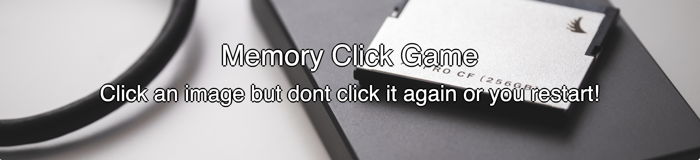
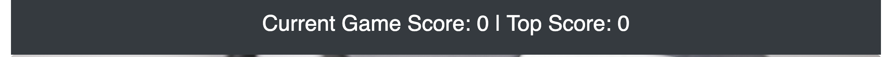
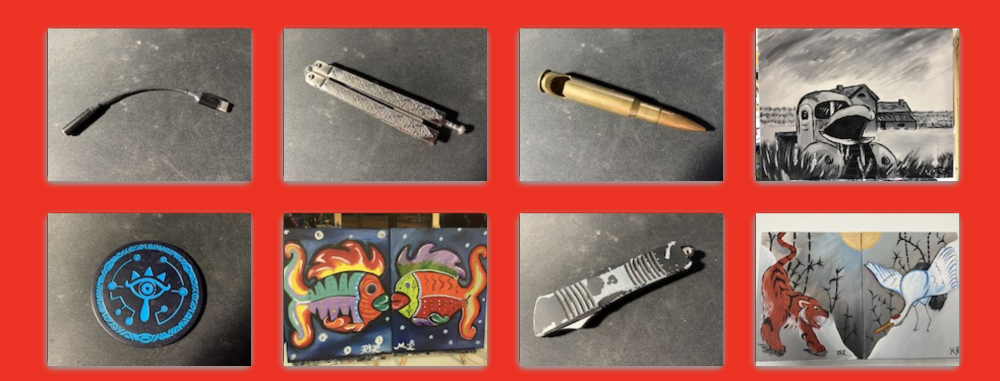

# Memory Click

This application will have the user click on random cards that are generated.  The user can only click on a card once or else the scoreboard will restart and the game will reset.

## Resources used

[React](https://reactjs.org) is used to grab multiple components and display on one page without having click on another link or reload the page.
Library, package or technology used: [Bootstrap](https://getbootstrap.com/)
[Heroku](https://www.heroku.com) is used to host the application.

## How good is your memory?

Welcome to **Memory Click**! the game where you have to remember what image you clicked and try not to click it again.

## Time to beat your personal best!

There will be a scoreboard that will score your current and overall best score of not clicking the same image more than once.

## Images Galore

14 images will be displayed that the user will have to try not to click more than once.

## Application

There is a link to the application [I am mentally prepared](https://protected-oasis-51713.herokuapp.com)
